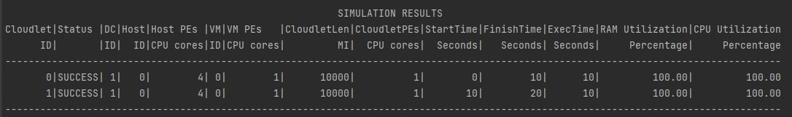
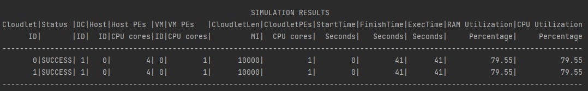
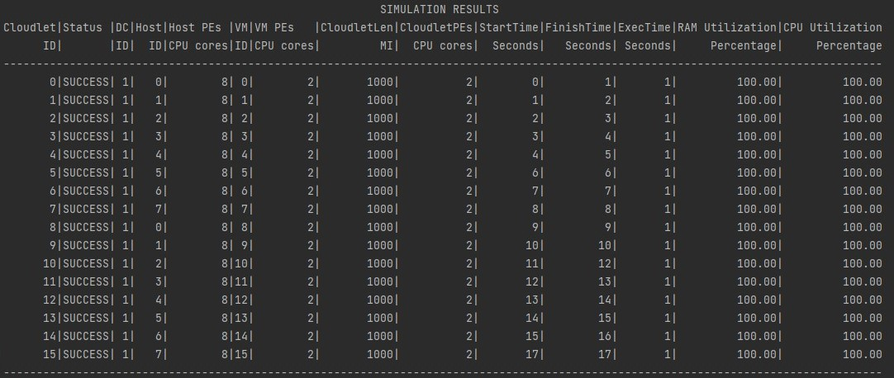
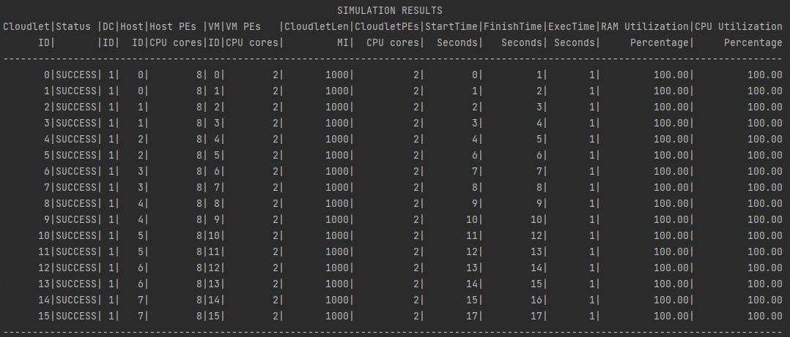
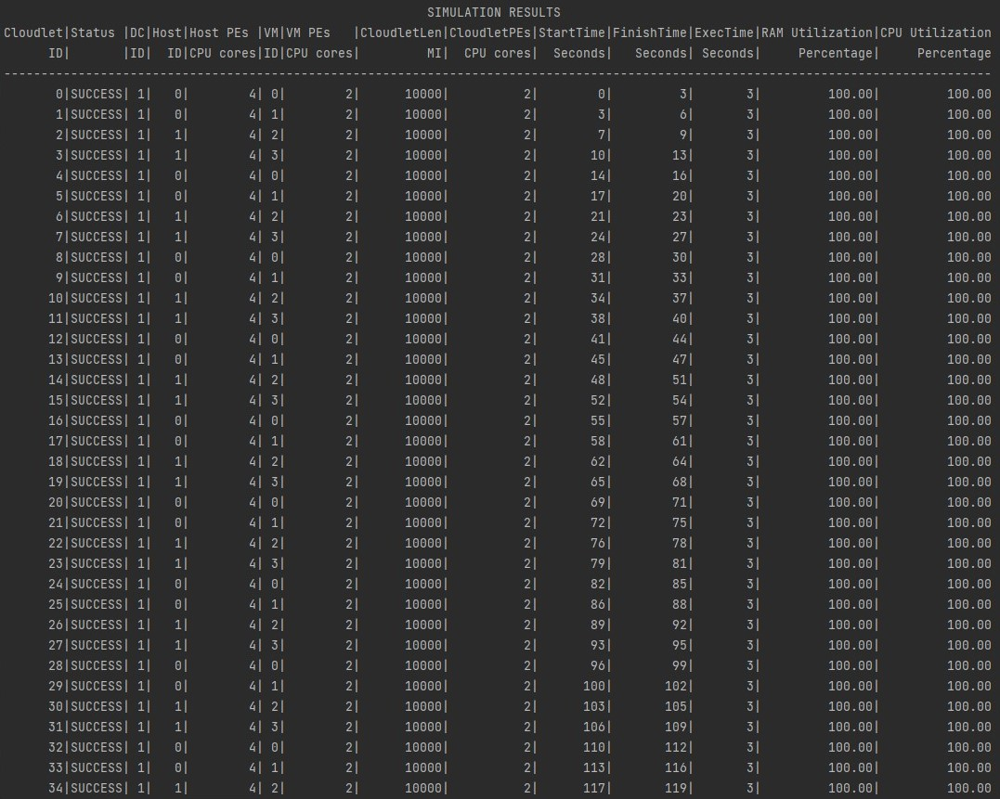
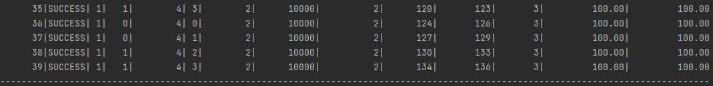
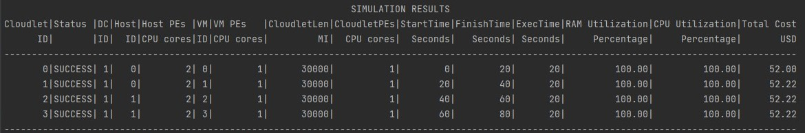
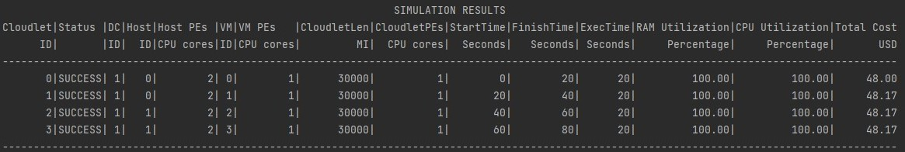
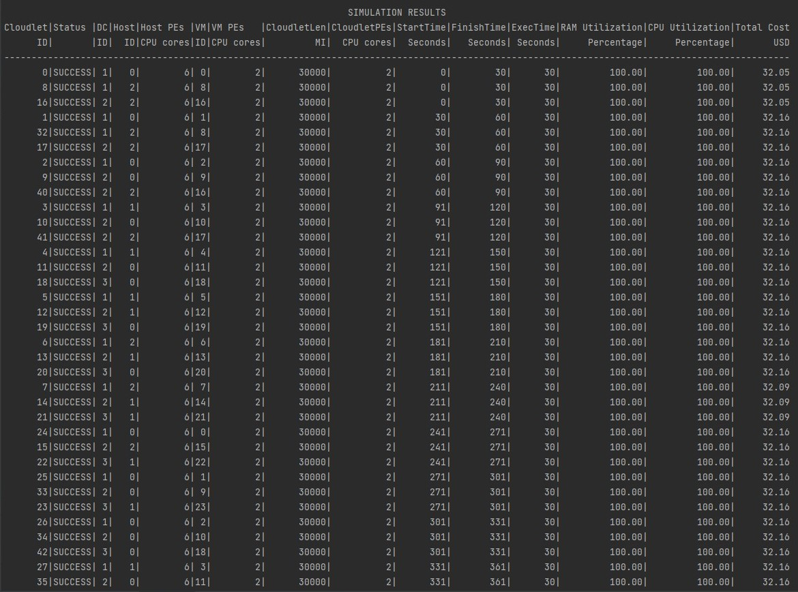

# CS 441 HW 1

## Introduction: This repository contains the programs necessary to run various simulations of datacenters using the popular CloudSimPlus framework. A total of 8 simulations have been written here in 5 files with distinct simulation themes.

## Project set up
+ Clone the project or download the repo in a zip format
+ Open a terminal at the root level of the repository
+ To run the test cases written for the simulations,

```
sbt clean compile test
```

+ To run the simulations themselves (all 8 of them one after the other)

```
sbt clean compile run
```

## Application Design

These are the main simulation files found in the src/scala/Simulations directory:-
+ `SchedulerComparison` is the first program written and consequently, executed by the run command. This program contains 2 simulations which form the basis for task one of the requirements of the homework. Here, the VM and Cloudlet scheduler policies are compared while keeping (almost) everything else constant. The cloudlet utilization model is the only thing changed here apart from the schedulers, which will be explained in the results section below.

+ `AllocationComparison` is the second program written and consequently, executed by the run command. This program also contains 2 simulations which form the basis for task two of the requirements of the homework. Here, the VM allocation policies are explored while keeping everything else constant. The allocation policies chosen were the Round Robin and Best Fit policies.

+ `NetworkSimulation` attempts to simulate a network datacenter. Here, a topology consisting of edge switches, aggregate switches and a root switch is used to connect hosts within the datacenter. A BestFit VM allocation policy is used to understand the scenario in terms of a network datacenter with switching delays involved.

+ `CostSimulation` attempts to model 2 datacenters with varying cost strategies. The 2 datacenters can be considered to be from different competitive cloud providers, who each have their strengths and weaknesses.

+ `ModelsSimulation` is the final task given in the homework for the main textbook owners. Here, I have implemented 3 datacenters each configured with IaaS, PaaS and SaaS idealogies. This is emulated through the use of 2 configuration files for each idealogy. There is a "locked" configuration file for each topology which contains all the necessary configuration parameters for setting up a simulation, while there is also a "user" configuration file which for each topology, indicating the elements of the datacenter they are in control of. For e,g- for a IaaS idealogy, the "locked" file contains all parameters to initialize, while the "user" file contains the various VM parameters (VM size, cores, storage, bandwidth, mips) which a user of a IaaS datacenter would configure by themselves. This strategy ensures seperation of control over things the user should have no control of, like cost values.

These simulation files have a lot of repeated actions in terms of host, datacenter, vm, cloudlet etc creation to name a few. Hence, to facilitate easier understanding and improving the codebase functionally, there is a seperate CommonUtils package created which houses the respective utility functions. They are:-
+ `cloudletUtil` is the utility file which reads cloudlet configuration and handles multiple cloudlet creation

+ `vmUtil` is the utility file to read VM configuration and creation of multiple VM's. This utility also handles reading VM configuration from appropriate configuration file in terms of the "locked" configuration and the "user" configuration for the various IaaS, PaaS and SaaS idealogies.

+ `hostUtil` is a short utility file to read host configuration.

+ `datacenterUtil` is a large utility file housing more of the utility code in terms of host and datacenter creation. The complexity comes in terms of handling the IaaS and PaaS idealogies, host creation and the selection between a NetworkDataCenter and a SimpleDataCenter. This utility file also contains a network topology mapper which creates and configures all the types of switches, namely the edge, aggregate and root switches. They are manually connected in the appropriate function.

The resources directory contains the respective configuration file for each of these simulations. The test cases are written in Scala using the AnyFunSuite and they are located in the test directoy where you'd expect them.

## Simulation results

1. Scheduler Comparisons- A single host, single VM and 2 cloudlets are utilized here to demonstrate the differences between the schedulers. To elaborate on a previous statement, the utilization model for the cloudlets was changed here as using the standard `UtilizationModelFull()` led to cloudlets waiting for RAM and Bandwidth in `TimeSharedScheduler` for the cloudlets. This makes sense as the first cloudlet to begin executing will take up all the resources, while the others will starve. This problem does not occur on `SpaceSharedScheduler` for the cloudlets.

#### SpaceShared scheduler for both VM and cloudlets with UtilizationModelFull for cloudlets
<p align="center">
  
</p>

#### TimeShared scheduler for both VM and cloudlets with UtilizationModelStochastic for cloudlets
<p align="center">
  
</p>

2. Allocation Comparisons- 8 hosts, 16 VM's and 16 cloudlets are used here to find out the differences among the allocation policies. The logged messages helped to understand how the policies worked differently.

#### Round Robin VM allocation policy
<p align="center">
  
</p>

#### BestFit VM allocation policy
<p align="center">
  
</p>

3. Network simulation- The primary goal here was to understand how the networking works within a datacenter with regards to the various different types of switches and their interconnections. This was simulated using a datacenter containing 2 hosts, 8 edge switches each with 4 ports, 3 aggregate switches each with 4 ports and a root switch with 4 ports. A load of 40 cloudlets was given to the simulation here. Here are the findings,

<p align="center">
  
</p>
<p align="center">
  
</p>

4. Cost simulation- 2 competitive datacenters were set up with varying costs per feature. The goal here was to analyze the costing for running a cloudlet on each of the datacenters to enable a clever broker to develop a heuristic to provide middleman services.

#### Datacenter with higher cost per second and higher MIPS
<p align="center">
  
</p>

#### Datacenter with higher cost per storage and higher memory
<p align="center">
  
</p>

5. Model simulation- The final task consists of creating 3 different datacenters for each of IaaS, PaaS and SaaS idealogies. This was done by assuming a methodology of providing user configuration apart from the datacenter "stock" configuration depending upon the idealogy. The cloud provider would initialize their datacenter completely with their own configuraion, which an IaaS user for example would be able to modify large parts of to suit their need in regards to the workload. The concerned IaaS user can increase/decrease their VM's or make their VM's more/less powerful. A series of jobs were then sent to the datacenters and simulated.

<p align="center">
  
</p>


### Understandings

This project cleared a lot of concepts with regards to a task and VM allocation as well as scheduling. In terms of being a broker and managing such a service, some learnings were:
+ Selecting the full utilization model for a cloudlet is very contigent upon the cloudlets scheduling policy. If it is a TimeShared policy, some cloudlets will be left starving for resources and bog down the system without even executing the task.

+ Over provisioning resources is comparatively "easier" as you can just throw more hosts at the problem, which are cheap. But a wise heuristic set by determining average workload lengths, workload intensities and timings will help scale back on these costs which add up quickly. Under provisioning is ofcourse very detrimental and might create a negative feedback loop of angry customers not having their jobs completed and you losing computation time as well as your customer base.

+ Providing IaaS is more worry-free as you are only providing "bare metal". Everything else is the cloud consumer's responsibility. Thus, there aren't a lot of factors to consider in terms of pricing the IaaS model. On the other hand, all the talk about over and under provisioning comes in effect for SaaS doubly so.

+ It was also noticed that in the first simulation with Scheduler comparisons and specifically the TimeShared cloudlet scheduler with a Stochastic utilization model, the execution time of the cloudlets will vary with each run of the program.